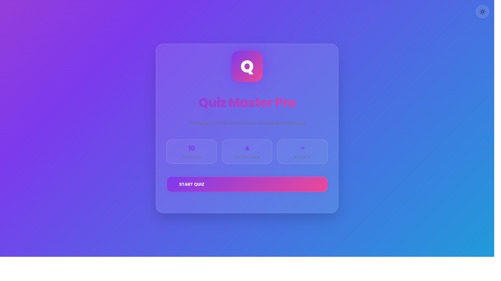

🚀 Quiz Application – Dockerized with CI/CD & Kubernetes

A modern, responsive Quiz Web Application built using HTML, CSS, and JavaScript, containerized with Docker, automated using GitHub Actions (CI/CD), and deployed on Kubernetes for scalability and high availability.

📌 Project Overview

This project demonstrates how a simple frontend application can be deployed using modern DevOps practices.

The application:

Runs inside a Docker container

Uses Nginx to serve static files

Automatically builds and pushes Docker images using GitHub Actions

Deploys to a Kubernetes cluster with multiple replicas

Uses LoadBalancer service for external access

🏗 Tech Stack

Frontend: HTML, CSS, JavaScript

Containerization: Docker

Web Server: Nginx

CI/CD: GitHub Actions

Orchestration: Kubernetes
📂 Project Structure
quiz-app/
│
├── index.html
├── style.css
├── script.js
├── Dockerfile
├── deployment.yaml
├── service.yaml
└── .github/workflows/deploy.yml

🐳 Docker Setup
Dockerfile
FROM nginx:alpine

RUN rm -rf /usr/share/nginx/html/*

COPY . /usr/share/nginx/html

EXPOSE 80

CMD ["nginx", "-g", "daemon off;"]

Build Docker Image
docker build -t quiz-app .

Run Container
docker run -p 8080:80 quiz-app

Access the app at:

http://localhost:8080

🔁 CI/CD Pipeline (GitHub Actions)

The CI/CD workflow automatically:

Triggers on push to main

Builds Docker image

Pushes image to Docker Hub

Workflow File

.github/workflows/deploy.yml

name: CI/CD Pipeline

on:
  push:
    branches:
      - main

jobs:
  build:
    runs-on: ubuntu-latest

    steps:
      - uses: actions/checkout@v3

      - uses: docker/login-action@v2
        with:
          username: ${{ secrets.DOCKER_USERNAME }}
          password: ${{ secrets.DOCKER_PASSWORD }}

      - run: docker build -t yourusername/quiz-app:latest .

      - run: docker push yourusername/quiz-app:latest

☸ Kubernetes Deployment
Deployment Configuration

deployment.yaml

apiVersion: apps/v1
kind: Deployment
metadata:
  name: quiz-app
spec:
  replicas: 2
  selector:
    matchLabels:
      app: quiz-app
  template:
    metadata:
      labels:
        app: quiz-app
    spec:
      containers:
        - name: quiz-app
          image: yourusername/quiz-app:latest
          ports:
            - containerPort: 80

Service Configuration

service.yaml

apiVersion: v1
kind: Service
metadata:
  name: quiz-service
spec:
  type: LoadBalancer
  selector:
    app: quiz-app
  ports:
    - port: 80
      targetPort: 80

Deploy to Cluster
kubectl apply -f deployment.yaml
kubectl apply -f service.yaml

Check status:

kubectl get pods
kubectl get services

📈 Architecture Overview
User
  ↓
Kubernetes LoadBalancer Service
  ↓
Quiz App Pods (2 replicas)
  ↓
Docker Container (Nginx)
  ↓
Static Frontend Files

🔥 Key Features Implemented

Containerized frontend application

Automated CI/CD pipeline

Scalable Kubernetes deployment

High availability with multiple replicas

Load balancing

Production-ready architecture

🎯 Why This Project?

This project demonstrates:

DevOps integration in frontend apps

Infrastructure as Code (Kubernetes YAML)

Continuous Deployment workflows

Scalable and fault-tolerant system design

🧠 Learning Outcomes

Understanding Docker containerization

Implementing CI/CD pipelines

Deploying applications to Kubernetes

Managing scalable production systems

🏆 Resume Highlight

Deployed a production-ready Quiz Application using Docker, GitHub Actions CI/CD, and Kubernetes with load balancing and scalable replicas
